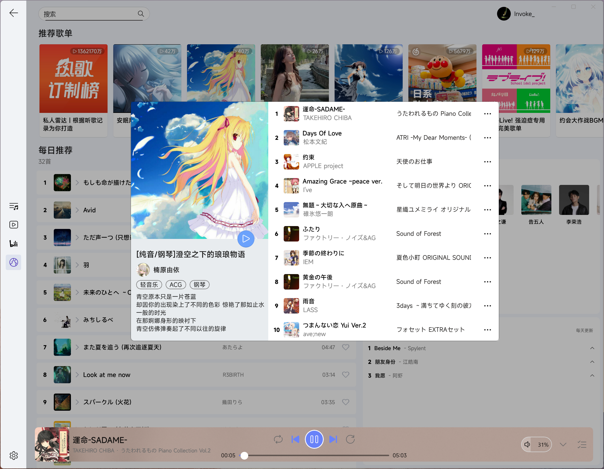

# 火锅播放器
## 一个多功能音视频播放器
集成Jellyfin音乐、视频播放，以及在线的Bilibili视频播放和网易云音乐播放

### Jellyfin音乐

### Jellyfin视频

### B站视频

### 网易云

## 视频播放原理
集成mpv播放器内核。mpv初始化vo时，会创建HwndSwapChain，将其修改为创建CompositionSwapChain，并将其暴露到C#中。C#捕获这个CompositionSwapChain，并将其赋值给WinUI3的SwapChainPanel，即可在UI中显示视频画面。
源代码在[https://github.com/WangyuHello/mpv](https://github.com/WangyuHello/mpv)

## 弹幕渲染原理
使用Win2D绘制文字，并传递到WinUI的Composition层（表现为一个Visual），用一个Control来承载这个Visual，并添加到Grid中，此时UI中便可显示弹幕文字。使用Composition Animation操作Visual来实现弹幕横向移动。此外Win2D还可以绘制各种特效文字，例如黑边、阴影。所有操作都在WinUI的Composition层完成，无需额外的显存和内存之间的拷贝，效率高。